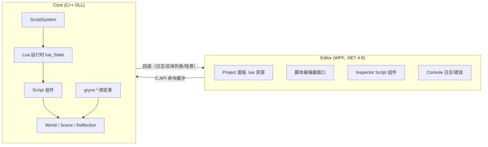

# 脚本系统（Lua）设计方案

> 状态：规划中（未开始实现）。本文描述给 GryceEngine 增加脚本支持的完整方案：
> Core（C++）嵌入 Lua，Editor（WPF）只通过 C API 命令缓冲与 Core 通信，脚本文件作为项目资源管理。

## 1. 目标与边界

### 目标
- 实体可以挂一个 `Script` 组件，绑定项目内的 `.lua` 文件；播放模式下脚本驱动实体逻辑（每帧 `on_update`）。
- 编辑器支持：项目面板浏览/打开 `.lua`、添加 Script 组件、Inspector 查看脚本路径与暴露变量、脚本编辑窗口、脚本日志/错误进入控制台、保存后热重载。
- 保持既有架构约束：**Core 与 Editor 完全分离**。脚本在 Core 内部执行（游戏线程），Editor 绝不执行脚本，只通过 `GryceCore.dll` 的 C API + 命令缓冲（`GCore_PushCommand`）控制脚本的加载/重载/路径设置。

### 非目标（首轮不做）
- 脚本调试器（断点/单步）、跨语言热重载的复杂语义、多脚本语言、可视化蓝图/节点脚本、网络/多人。
- 多租户沙箱隔离（首轮信任脚本，运行在引擎进程内；文档注明风险）。

## 2. 技术选型

| 方案 | 结论 |
|---|---|
| **Lua 5.4 + 纯 C API** | **采用**。稳定、可嵌入、开销小、MSVC/GCC 均无 ABI 问题；手写 `gryce.*` 绑定表简单可控。 |
| Lua + sol2（头文件模板库） | 备选。省绑定代码，但引入 C++ 模板层，出错信息复杂，与现有"零/少依赖"风格不一致。 |
| Python 嵌入（CPython） | 否决。体积大、GIL/初始化重、发行麻烦。 |
| JavaScript（QuickJS/Duktape） | 可作备选；生态/心智模型不如 Lua 通用。 |
| C#（Editor 同语言） | 否决。需在 C++ Core 内嵌 .NET 运行时，与"Core 独立"架构冲突。 |

Lua 源码 vendor 到 `third_party/lua`（仅核心库 + 裁剪后的标准库），遵循现有 `third_party/nlohmann_json`、`stb` 的模式，接入 CMake。

## 3. 总体架构



- **执行位置**：脚本只在 Core 的游戏帧内运行。现有 `GCore_BeginFrame` 中已有
  `if (play_mode && !paused) world->update(dt);`，ScriptSystem 作为 `ISystem` 挂进 World，
  天然满足"编辑器模式不跑、播放才跑"。
- **通信**：Editor → Core 全部走命令缓冲；Core → Editor 走既有回调
  （`GOnLogMessage` 用于脚本 print/错误，`GOnEntityListChanged` 用于运行时创建实体的刷新）。

## 4. Core 侧设计

### 4.1 Lua 运行时
- 新增 `core/script/` 目录：
  - `lua_runtime.h/.cpp`：全局 `lua_State*` 的生命周期（引擎初始化时创建、关闭时销毁），标准库加载裁剪。
  - `lua_bindings.h/.cpp`：`gryce.*` API 表。
  - `script_component.h`：`Script` 组件。
  - `script_system.h/.cpp`：`ScriptSystem`（ISystem）。
- 全局一个 `lua_State`；**每个 Script 组件持有一个独立环境表**（`lua_newtable` + 设置元表指向全局），
  避免脚本间全局变量互相污染；脚本可显式访问 `_G` 通信（首轮允许）。

### 4.2 Script 组件
- 经 `ComponentFactory` 注册 `"Script"`（与既有组件一致）：
  - 反射字段（走 `core/reflection/reflection.h` 的 `GRYCE_REFLECT_*`）：
    - `script_path`（string，资源路径，如 `res://scripts/rotate.lua`）
    - `enabled`（继承自基类 `Component`）
  - 运行时字段（不序列化）：`lua_ref env_ref`、已加载 chunk 缓存、错误信息。
- `Add Component` 选择树新增分类 **Script**（图标、颜色、描述走现有 `ComponentCatalog`）。

### 4.3 ScriptSystem
- `priority` 放在动画系统之后、渲染之前；`on_init` 预加载所有 Script 组件；`on_update(scene, dt)` 逐个调用。
- 生命周期约定（Lua 侧约定函数，缺省为空）：
  ```lua
  function on_start() end          -- 实体创建/组件挂载、或播放开始时
  function on_update(dt) end       -- 每帧（play 模式下）
  function on_destroy() end        -- 实体销毁/组件移除时
  ```
- 错误处理：所有调用包 `pcall`；错误 → `GLOG_ERROR` + `GOnLogMessage` 回调进编辑器控制台，
  组件标记 `error_state`（每帧只报一次，避免刷屏）。
- 场景切换/实体销毁时清理：按实体句柄缓存 env，销毁时 `luaL_unref`。

### 4.4 Lua API（`gryce.*`）

首轮最小集合：

| 分组 | API | 说明 |
|---|---|---|
| 实体 | `gryce.self()` | 当前脚本所属实体句柄 |
| | `gryce.entity.get_name(h)` / `find(name)` | 场景查询 |
| | `gryce.entity.get_transform(h)` / `set_transform(h, pos, rot, scl)` | 变换读写（复用 `EntityAPI` 逻辑） |
| | `gryce.entity.create(name, parent)` / `destroy(h)` | 运行时实例化（可选首轮） |
| 组件 | `gryce.component.get(h, type_name, prop)` / `set(...)` | 走反射 `Registry::all_fields` 读写任意属性 |
| 输入 | `gryce.input.key_down(key)` / `mouse_pos()` | 复用 Core 已保存的输入状态（Editor 已推 `ECMD_INPUT_*`） |
| 时间 | `gryce.time.delta()` / `elapsed()` | |
| 日志 | `gryce.log.info/warn/error(...)` | 进控制台 |
| 场景 | `gryce.scene.load(path)` | 可选 |

绑定实现为普通 C 函数（`lua_CFunction`），内部调用 Core 已有模块，不做重实现。

### 4.5 命令缓冲扩展
- 新增 `ECMD_SET_SCRIPT`（payload：实体句柄 + script_path），用于 Editor 在 Inspector 中修改脚本路径；
  以及 `ECMD_RELOAD_SCRIPTS`（播放中保存后热重载）。
- Editor 侧 `EditorViewModel` 增加对应包装方法（与 `RenameEntity`/`SetTransform` 等一致：编码 payload → `GCore_PushCommand`）。
- 也可首轮直接复用 `ECMD_SET_PROPERTY`（`Script.script_path` 是反射字段），显式命令作为 Phase 1 收尾的清理项。

### 4.6 暴露属性（Inspector 显示脚本变量）
- 约定：脚本顶部定义 `gryce.props()` 返回表，或约定全局表 `props = { speed = 1 }`。
- Core 加载脚本后扫描 props 表，动态注册为 Script 组件的临时反射字段（前缀 `script.`），
  Inspector 复用现有属性 UI 读写，写回 Lua 环境；序列化时按反射字段落盘 `.gesc`。
- **阶段化**：Phase 1 只序列化 `script_path` + `enabled`；暴露属性放 Phase 3。

## 5. Editor 侧设计

### 5.1 项目面板
- `.lua` 文件图标（Fluent 图标 + 颜色，走现有 `FileItem` 图标映射）；双击打开脚本编辑器。

### 5.2 脚本编辑器（新增窗口/停靠面板）
- 文本编辑：等宽字体、行号、Ctrl+S 保存；基础 Lua 语法高亮（关键字/字符串/注释，用现有 WPF 控件实现，不引第三方编辑器）。
- 保存后向 Core 推 `ECMD_RELOAD_SCRIPTS`（编辑器中可"播放并验证"）。

### 5.3 Add Component
- 选择树新增 "Script" 分类；选择后实体名按现有"创建实体→进入新建组件"流程处理（实体改名 `Script`）。

### 5.4 Inspector
- Script 组件显示 `script_path`（文本框 + 从项目面板选择）、`enabled`、以及暴露属性（Phase 3）。

### 5.5 控制台
- 脚本 `print`/`error` 经 `GOnLogMessage` 进入现有控制台（级别颜色沿用）。

### 5.6 播放与热重载
- 播放模式进入时 ScriptSystem 加载脚本；编辑器内保存脚本 → 自动重载（或工具栏"重载脚本"按钮）。

## 6. 实施阶段

### Phase 0 — Spike（验证嵌入可行性）
- vendor Lua 5.4 源码 + CMake 接入；引擎初始化/关闭时创建/销毁 `lua_State`。
- 冒烟：加载 `res://scripts/hello.lua`，执行 `gryce.log.info("hi")`，编辑器控制台可见。
- 验收：`examples/` 下新增 hello 脚本示例；控制台正确显示日志。

### Phase 1 — Core 基础
- Script 组件 + ScriptSystem + 生命周期（on_start/on_update/on_destroy）+ pcall 错误上报。
- `gryce.self / entity 变换 / 时间 / 日志 / 输入查询` 绑定。
- 序列化（.gesc 保存 script_path/enabled）与场景加载恢复。
- 验收：给 Cube 挂脚本每帧自转；保存/重载场景后脚本仍工作；脚本抛错在控制台显示且不崩。

### Phase 2 — Editor 基础
- AddComponent 增加 Script；Inspector 显示 script_path（可改）；项目面板 .lua 图标；脚本日志进控制台。
- 新增 `ECMD_SET_SCRIPT` / `ECMD_RELOAD_SCRIPTS` 及 Editor 包装。
- 验收：编辑器内改脚本路径生效；播放时脚本运行。

### Phase 3 — 脚本编辑器 + 暴露属性
- 脚本编辑窗口（行号/高亮/保存/重载）；props 反射进 Inspector 并可编辑。
- 验收：编辑脚本保存后热重载；Inspector 改脚本变量即时生效并随场景保存。

### Phase 4 — 打磨
- 热重载健壮性（播放中重载保留实体状态）、示例脚本集（旋转/移动/点击销毁/计时器）、
  性能（同脚本多实体共享 chunk）、文档（脚本 API 手册）。

## 7. 风险与权衡

- **脚本状态与场景生命周期**：实体销毁/场景切换时须清理 Lua 引用，防止悬垂句柄/泄漏 —— ScriptSystem 按实体句柄管理 env，销毁回调兜底。
- **线程模型**：Lua 只在 Core 游戏帧（`GCore_BeginFrame` 内 `world->update`）执行；Editor UI 线程不触碰 Lua。约定所有绑定函数只允许在游戏线程调用（文档注明，首轮不加锁）。
- **性能**：每组件独立 env 表 + `pcall` 开销可控；大量实体复用同一脚本时共享编译产物（`luaL_loadbuffer` 缓存），只复制闭包。
- **依赖与构建**：Lua 是唯一新增第三方，纯 C、MSVC/GCC 通用；接入现有 CMake（参考 nlohmann_json/stb）。
- **安全**：首轮信任脚本（与引擎同进程、同权限），不做沙箱；文档明确风险，后续可加白名单 API 或子进程。
- **ABI**：纯 C API 绑定，无 C++ ABI 跨编译器问题（编辑器侧仅经 `GryceCore.dll` C 接口）。

## 8. 涉及现有代码位置

- 组件注册：`core/components/component_factory.cpp`
- 反射字段：`core/reflection/builtin_reflections.cpp`、`core/reflection/reflection.h`
- 命令缓冲：`core/api/core_api.cpp`（`process_command`、`GCore_BeginFrame`）、`core/GryceCore/types.h`（`ECMD_*`）
- 世界/系统：`core/ecs/world.cpp`、`core/ecs/system.h`、`core/scene/scene.cpp`
- 序列化：`core/scene/`（.gesc JSON）
- C API 头：`core/GryceCore/*.h`、`core/api/*.cpp`
- Editor：`editor/src/Services/EngineService.cs`、`editor/src/ViewModels/EditorViewModel.cs`、
  `editor/src/Views/{ProjectView,InspectorView,AddComponentDialog,ConsoleView}.xaml(.cs)`
