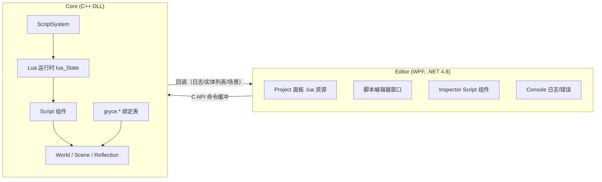

# 脚本系统（Lua）设计方案

> 状态：规划中（未开始实现）。本文描述给 GryceEngine 增加脚本支持的完整方案：

> Core（C++）嵌入 Lua，Editor（WPF）只通过 C API 命令缓冲与 Core 通信，脚本文件作为项目资源管理。

## 1. 目标与边界

### 目标

- 实体可以挂一个 `Script` 组件，绑定项目内的 `.lua` 文件；播放模式下脚本驱动实体逻辑（每帧 `on_update`）。

- 编辑器支持：项目面板浏览/打开 `.lua`、添加 Script 组件、Inspector 查看脚本路径与暴露变量、脚本编辑窗口、脚本日志/错误进入控制台、保存后热重载。

- 保持既有架构约束：**Core 与 Editor 完全分离**。脚本在 Core 内部执行（游戏线程），Editor 绝不执行脚本，只通过 `GryceCore.dll` 的 C API + 命令缓冲（`GCore_PushCommand`）控制脚本的加载/重载/路径设置。

### 非目标（首轮不做）

- 脚本调试器（断点/单步）、跨语言热重载的复杂语义、多脚本语言、可视化蓝图/节点脚本、网络/多人。

- 多租户沙箱隔离（首轮信任脚本，运行在引擎进程内；文档注明风险）。

## 2. 技术选型

| 方案 | 结论 |

|---|---|

| **Lua 5.4 + 纯 C API** | **采用**。稳定、可嵌入、开销小、MSVC/GCC 均无 ABI 问题；手写 `gryce.*` 绑定表简单可控。 |

| Lua + sol2（头文件模板库） | 备选。省绑定代码，但引入 C++ 模板层，出错信息复杂，与现有"零/少依赖"风格不一致。 |

| Python 嵌入（CPython） | 否决。体积大、GIL/初始化重、发行麻烦。 |

| JavaScript（QuickJS/Duktape） | 可作备选；生态/心智模型不如 Lua 通用。 |

| C#（Editor 同语言） | 否决。需在 C++ Core 内嵌 .NET 运行时，与"Core 独立"架构冲突。 |

Lua 源码 vendor 到 `third_party/lua`（仅核心库 + 裁剪后的标准库），遵循现有 `third_party/nlohmann_json`、`stb` 的模式，接入 CMake。

## 3. 总体架构



- **执行位置**：脚本只在 Core 的游戏帧内运行。现有 `GCore_BeginFrame` 中已有

`if (play_mode && !paused) world->update(dt);`，ScriptSystem 作为 `ISystem` 挂进 World，

天然满足"编辑器模式不跑、播放才跑"。

- **通信**：Editor → Core 全部走命令缓冲；Core → Editor 走既有回调

（`GOnLogMessage` 用于脚本 print/错误，`GOnEntityListChanged` 用于运行时创建实体的刷新）。

## 4. Core 侧设计

### 4.1 Lua 运行时

- 新增 `core/script/` 目录：

- `lua_runtime.h/.cpp`：全局 `lua_State*` 的生命周期（引擎初始化时创建、关闭时销毁），标准库加载裁剪。

- `lua_bindings.h/.cpp`：`gryce.*` API 表。

- `script_component.h`：`Script` 组件。

- `script_system.h/.cpp`：`ScriptSystem`（ISystem）。

- 全局一个 `lua_State`；**每个 Script 组件持有一个独立环境表**（`lua_newtable` + 设置元表指向全局），

避免脚本间全局变量互相污染；脚本可显式访问 `_G` 通信（首轮允许）。

### 4.2 Script 组件

- 经 `ComponentFactory` 注册 `"Script"`（与既有组件一致）：

- 反射字段（走 `core/reflection/reflection.h` 的 `GRYCE_REFLECT_*`）：

- `script_path`（string，资源路径，如 `res://scripts/rotate.lua`）

- `enabled`（继承自基类 `Component`）

- 运行时字段（不序列化）：`lua_ref env_ref`、已加载 chunk 缓存、错误信息。

- `Add Component` 选择树新增分类 **Script**（图标、颜色、描述走现有 `ComponentCatalog`）。

### 4.3 ScriptSystem

- `priority` 放在动画系统之后、渲染之前；`on_init` 预加载所有 Script 组件；`on_update(scene, dt)` 逐个调用。

- 生命周期约定（Lua 侧约定函数，缺省为空）：

```lua

function on_start() end -- 实体创建/组件挂载、或播放开始时

function on_update(dt) end -- 每帧（play 模式下）

function on_destroy() end -- 实体销毁/组件移除时

```

- 错误处理：所有调用包 `pcall`；错误 → `GLOG_ERROR` + `GOnLogMessage` 回调进编辑器控制台，

组件标记 `error_state`（每帧只报一次，避免刷屏）。

- 场景切换/实体销毁时清理：按实体句柄缓存 env，销毁时 `luaL_unref`。

### 4.4 Lua API（`gryce.*`）

首轮最小集合：

| 分组 | API | 说明 |

|---|---|---|